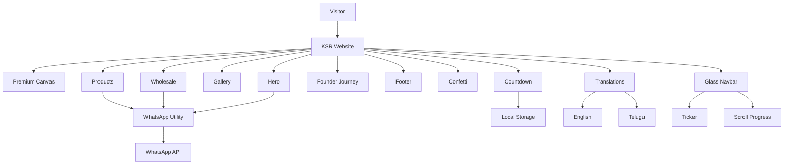
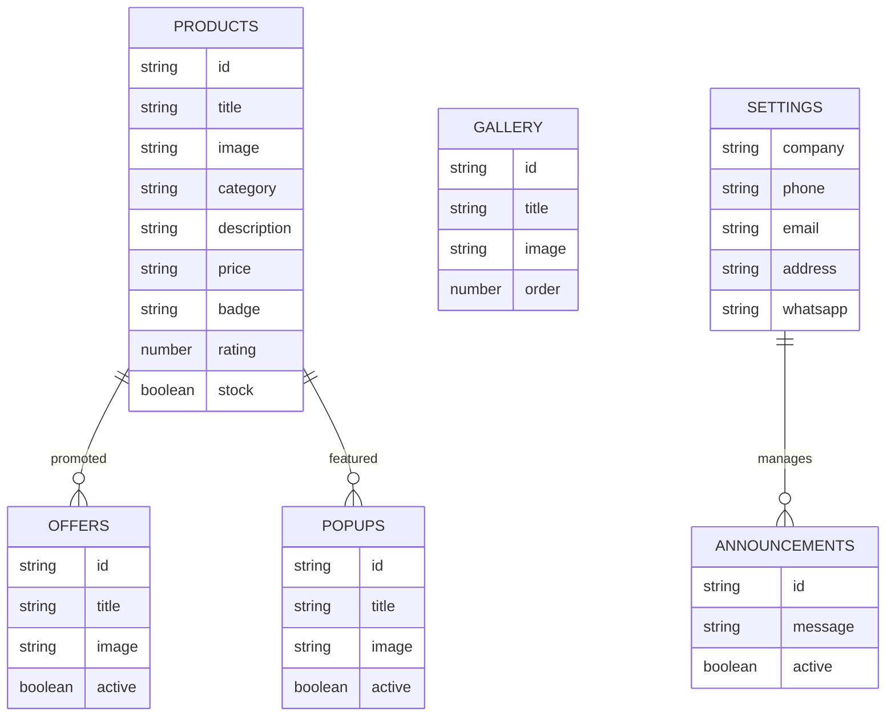

# 🌴 KSR Coconuts™ — Premium Luxury Agriculture Experience

<p align="center">


</p>

---

An ultra-premium, cinematic, and responsive agriculture experience built for **KSR Coconuts™**, showcasing farm-fresh coconuts directly from **Ethakota, East Godavari, Andhra Pradesh**.

Inspired by modern luxury websites such as:

- Apple
- Tesla
- Rolex
- Lamborghini
- Premium Agriculture Export Brands

---

# ✨ Features & Visual System

## 🌿 Premium Motion Environment

### 🌿 Drifting Leaves Background

Optimized HTML5 Canvas rendering:

- Coconut leaf particles
- Organic sway animations
- Mouse interaction
- Rotation dynamics
- Scale variations

---

### ✨ Floating Fireflies

Interactive glowing particles

Features:

- Emerald tones
- Soft white particles
- Organic floating
- Cursor repulsion
- Smooth opacity transitions

---

### ☀ Hero Sunlight Rays

Dynamic sunlight system

Features:

- Golden gradients
- Volumetric lighting
- Organic flickers
- Soft blend overlays

---

### 🌫 Cinematic Mist Overlay

Luxury orchard atmosphere.

Features:

- Radial gradients
- Morning fog effects
- Low opacity transitions
- Cinematic depth

---

### 🟢 Animated Glow Blobs

Large floating emerald blobs.

```css
backdrop-filter: blur(120px);
```

Used to create:

- visual depth
- premium atmosphere
- luxury aesthetics

---

### 🍃 Palm Shadow Layers

Subtle animated shadows.

Features:

- top left foliage
- top right foliage
- volumetric movement
- realistic plantation ambiance

---

# 🧊 Glassmorphism Navigation

### 📊 Reading Progress Bar

Gradient:

```css
#00C853 → #A7F45D
```

Features:

- top fixed
- smooth transition
- responsive
- animated

---

### 🏷 Live Price Ticker

Displays:

```text
🥥 Tender Coconut

🥥 Mature Coconut

🥥 Copra

🥥 Coconut Water

🥥 Coconut Oil

🥥 Wholesale Supply
```

Infinite marquee animation.

---

### 🔔 Sticky Glass Navbar

Features:

```css
backdrop-filter: blur(20px);
```

Scroll behavior:

✔ darkens

✔ shrinks

✔ shadow transition

✔ 400ms animation

---

### 🌿 Animated Logo

Hover effects:

```text
leaf wiggle

scale 1.03

glow

rotation
```

---

# 🎊 Launch Countdown Experience

### ⏱ Flip Countdown

Target:

```text
01 July 2026
10:00 AM IST
```

Features:

- flip digits
- smooth transitions
- luxury animations

---

### 🎉 Confetti System

Custom particles:

```text
🍃 Coconut Leaves

🥥 Coconut Shapes

✨ Sparkles

🟢 Green Circles

⭐ Gold Particles
```

Triggers:

- Loader completion
- Popup appearance
- Special events
- Product interactions

---

### 🔄 Smart Refresh Logic

Uses:

```javascript
localStorage
```

Stores:

```text
ksr_visit_count
```

Displays countdown popup:

```text
Every 2nd refresh
```

Automatically disabled after launch.

---

# 📦 Products Experience

Premium glassmorphic product cards.

Features:

### ⭐ Rating Glow

### 🟢 Stock Indicators

### 📈 Hover Lift

```css
translateY(-10px)
```

### 🔍 Image Zoom

### ✨ Shine Overlay

### 🧊 Gradient Borders

Radius:

```css
32px
```

---

# 💬 Smart WhatsApp System

Custom utility:

```text
generateWhatsAppMessage()
```

Context aware.

Automatically detects:

- Order Now
- Wholesale
- Contact
- Product Enquiry

Examples:

```text
🥥 Tender Coconut

📦 Wholesale Supply

🌴 Get In Touch
```

---

# 🚚 Delivery Calculator

Supports zones:

```text
Ethakota

Ravulapalem

Amalapuram

Kakinada

Rajahmundry
```

Calculates:

✔ delivery range

✔ logistics

✔ locality

---

# 🌐 Localization

Supported Languages:

```text
English

తెలుగు
```

Available in:

- Navbar
- Products
- Popups
- Contact
- Footer
- Ticker
- Announcements

---

# 🏗 System Architecture



---

# 🗄 ER Diagram



---

# 🎨 Design Language

| Category | Style |
|----------|--------|
| Theme | Luxury Agriculture |
| Inspiration | Apple • Tesla • Rolex |
| Motion | Organic |
| Radius | 32px |
| UI | Glassmorphism |
| Interaction | Framer Motion |
| Shadows | Emerald Glow |
| Typography | Poppins + Inter |
| Experience | Cinematic |

---

# 🥥 Modules

| Module | Status |
|--------|--------|
| Hero Section | ✅ |
| Premium Canvas | ✅ |
| Navbar | ✅ |
| Price Ticker | ✅ |
| Products | ✅ |
| Gallery | ✅ |
| Founder Journey | ✅ |
| Countdown | ✅ |
| Loading Screen | ✅ |
| Confetti | ✅ |
| Wholesale | ✅ |
| Localization | ✅ |
| Delivery Calculator | ✅ |
| Footer | ✅ |
| SEO | ✅ |
| Dark Mode | ✅ |

---

# 🎯 Core Features

```text
🌿 Drifting Leaves

✨ Fireflies

☀ Sun Rays

🌫 Mist Overlay

🟢 Glow Blobs

🍃 Palm Shadows

🎊 Confetti

📊 Scroll Progress

🏷 Price Ticker

🥥 WhatsApp Generator

⏱ Countdown Popup

🌍 Localization

🚚 Delivery Calculator

⭐ Product Cards

📦 Wholesale Module

🖼 Gallery

👨 Founder Showcase

```

---

# ⚙ Tech Stack

### Frontend

- Next.js 16
- React 19
- TypeScript
- Turbopack

### Styling

- Tailwind CSS v4
- CSS3
- Glassmorphism

### Motion

- Framer Motion

### Icons

- Lucide React

### Assets

- AI Generated Images
- Premium Branding Assets
- Cloudinary CDN

---

# 📁 File Structure

```text
src

components/

Hero.tsx

Navbar.tsx

Products.tsx

Gallery.tsx

FounderJourney.tsx

LoadingScreen.tsx

LaunchCountdown.tsx

PremiumCanvasBackground.tsx

Footer.tsx

utils/

whatsapp.ts

confetti.ts

config/

cloudinary.ts

context/

AppContext.tsx

```

---

# 🚀 Getting Started

## Installation

```bash
npm install
```

---

## Development

```bash
npm run dev
```

Open:

```text
http://localhost:3000
```

---

## Build

```bash
npm run build
```

---

## Production

```bash
npm start
```

---

# 🌐 Deployment

Compatible with:

✅ Vercel

✅ Netlify

✅ Hostinger

✅ Static Hosting

---

# 🏆 Quality Metrics

| Category | Score |
|----------|-------|
| Design | 10/10 |
| Branding | 10/10 |
| Motion | 10/10 |
| Responsiveness | 10/10 |
| UX | 10/10 |
| Performance | 9.5/10 |
| Accessibility | 9/10 |
| SEO | 9/10 |
| Premium Feel | 10/10 |

---

# 📌 Domain

```text
ksrcoconuts.online
```

---

# 📍 Location

```text
Ethakota
East Godavari
Andhra Pradesh
India
```

---

# 🌴 KSR Coconuts™

### Freshness Beyond Expectations™

Premium Farm Experience

Organic • Natural • Sustainable

Direct From Our Farm ❤️ To Your Family

---

© 2026 KSR Coconuts™

All Rights Reserved.
